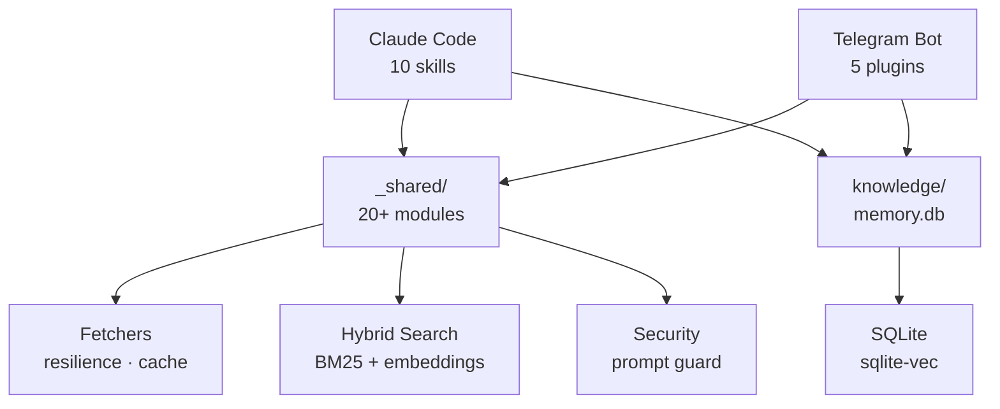

# MickaelV0/2ndBrain

**URL:** https://github.com/MickaelV0/2ndBrain
**Description:** 
**Language:** Python
**Stars:** 0 | **Forks:** 0
**License:** MIT License
**Last updated:** 2026-04-11

## README (excerpt)

# 2ndBrain


Personal knowledge management and automation system powered by Claude Code. Manages daily tasks, knowledge base, emails, LinkedIn content, CVs, and more through 10 Claude Code skills and an interactive Telegram bot.

## Features

### Claude Code Skills

- **Agenda & Planning** -- Consolidated daily view combining Google Calendar events and Google Tasks with due dates and priorities.
- **Knowledge Base** -- Save and search links (tweets, articles, GitHub repos, YouTube videos) with hybrid semantic + keyword search (BM25 + embeddings).
- **Task Manager** -- Google Tasks management with prioritization views, starred task tracking, and daily completion reports.
- **Email Summary** -- Gmail digest with filtering by status (read/unread), labels, and auto-categorization.
- **LinkedIn Post Generator** -- Short-form post and long-form article generation with hero image prompts, publication strategy, and markdown export.
- **CV Generator** -- Bilingual CV generation (FR/EN) in Markdown and HTML formats, with job offer adaptation and cover letter writing.
- **Image Prompt Generator** -- Optimized prompt generation for Grok, Gemini, DALL-E, and other AI image tools, with style catalog and creative variants.
- **Skill Creator** -- Tooling and templates for creating new Claude Code skills, with initialization scripts and validation.
- **Excalidraw** -- Diagram and flowchart manipulation via sub-agents, preventing context exhaustion from large JSON files.

### Telegram Bot

Interactive bot with 19 commands, 5 plugins (base, knowledge, course, pairing, supervisor), auto model switching (haiku/sonnet/opus), conversation compaction, multi-device pairing, and hybrid vector search.

### Architecture



## Quick Start

### Prerequisites

- Python 3.11+
- [Claude Code CLI](https://github.com/anthropics/claude-code)
- Google Cloud project with OAuth credentials (Calendar, Tasks, Gmail)
- (Optional) Telegram bot token for the interactive bot

### Installation

```bash
# Clone the repository
git clone https://github.com/MickaelV0/2ndBrain.git
cd 2ndBrain

# Install uv (if not already installed)
curl -LsSf https://astral.sh/uv/install.sh | sh

# Install dependencies
uv sync
```

### Configuration

Create `~/.claude/.env` with your credentials:

```bash
# Google OAuth (required for Calendar, Tasks, Gmail)
GOOGLE_OAUTH_CLIENT_ID=your_client_id
GOOGLE_OAUTH_CLIENT_SECRE...